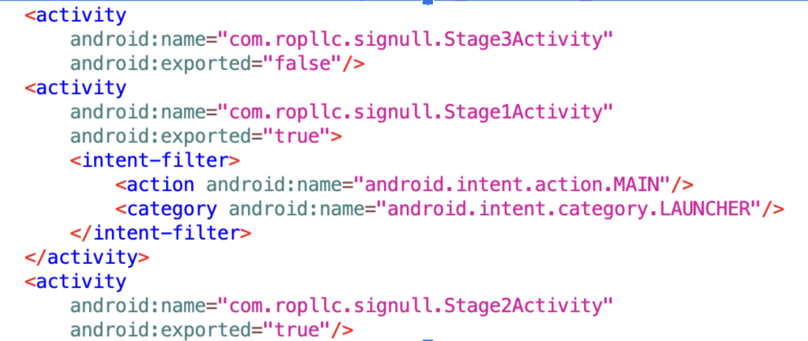

# TISC CSIT Challenge 7 — SIGNULL

**Category:** Mobile,Web,Reverse
**Challenge:** Reverse engineer an apk file to get the flag.

---

## Summary
1. Download the APK and use `jadx-gui` to decompile it.

2. Inspect `AndroidManifest.xml`. Activities with `exported="true"` can be started externally (e.g., via `adb`).

3. We see three main activities:
   - `Stage1Activity` (`intent` set to launcher — runs when the app launches)
   - `Stage2Activity` (`exported="true"` — can be started from the command line)
   - `Stage3Activity` (`exported="false"` — can only be reached internally)

   

4. Start an emulator (unrooted because the app checks for root) and install the app:
```bash
adb install <path-to-signull-apk>
```
5. Launching the app shows the stage1 layout but no interaction to reach stage2.

6. So we know that stage2 is not being navigated to by the app which is fishy. Given its exported tag is set to true, I decided to start it from the command line:
```
adb shell am start -n com.ropllc.signull/com.ropllc.signull.Stage2Activity
```
And we got the first half of the flag: 
### TISC{Th3_53c

7. Inspecting the decompiled stage2 code, the app makes POST requests to https://chals.tisc25.ctf.sg:21742 with endpoints /index.php and /login.php.

8. Stage2 checks the response of the login request and only on success does it start stage3. Because stage3 is not exported, we cannot start it with adb, we must reach the success branch. I planned to use Frida to edit the getBoolean("success") response at runtime 


10. Is important to note that stage2 checks if app is rooted or frida server installed on emulator.

There are two Frida approaches:
- Install Frida server on a rooted emulator (would fail the app's root check).
- Inject the Frida gadget into the APK (using objection), this does not require rooting and lets us inject scripts at runtime.

11. With that in mind lets install objection and frida-tools, then use objection to repatch the apk with the injected gadget.
```
pip3 install frida-tools objection
objection patchapk -s <apk-file-path>
```
12. Now install the patch apk on the emulator. On my host machine I created a frida payload script and ran command:
```
frida -U com.ropllc.signull -l intercept.js
```
13. After experimenting with editing the success check to always pass, I realise we actually need to trick the endpoint that we correctly login to generate a proper access token. Testing my luck, I decided to try SQL injection. 
14. SQL injection worked: using the username:
```SQL
' OR 1=1; #
```
We got the second part of flag:
### r3t_15_r0p11

15. Now we should be able to successfully be at stage3. Stage3 screen shows us that we can input indexes and the load button will load the message corresponding to that index. In the  js payload, intercept.js, I have intercepted the com.ropllc.signull.signullAPI.fetchMsg(str) to always use input 0 or 1=1. It worked and I could see the decoded response logging all the messages in the table. Stage 3 is also an SQL vulnerability.

16. Using a UNION-based payload to enumerate tables:
```SQL
0 OR 1=1 UNION SELECT table_name, NULL FROM information_schema.tables WHERE table_schema='signull'
```
17. Clicking load message again the server responded with all available table_names. We see a weird table name in format ```secret_<our-access-token>```
Change the payload to:
```SQL
0 OR 1=1 UNION SELECT * FROM secret_<access-token>
```

The decoded response should show the third part of the flag!

**Flag:** 
TISC{Th3_53cr3t_15_r0p11c_15_th3_B1GG35T_5c4m}

