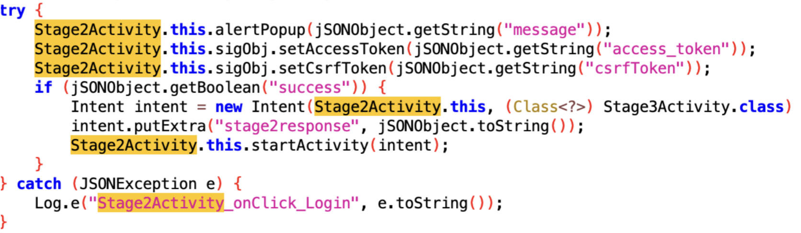

# TISC CSIT Challenge 7 — SIGNULL

**Category:** Mobile,Web,Reverse
**Challenge:** Reverse engineer an apk file to get the flag.

---

## Summary
1. Download the apk and use jadx-gui to decompile the apk. 

2. Analyse the manifest.xml file. An important thing to note is activities with exported=true tag can be started outside of the app (through adb command line).

3. We see three main activities:
- stage1 (intent set to launcher, means this activity will run when app lunch )
- stage2 (exported set as true means we can start this activity from command line)
- stage3 (exported set as false means we can only reach this activity internally)


4. We start our emulator(unrooted as the app checks if rooted) and run command:
```
adb install <path-to-signal-apk>
```
5. Starting the app we realise that we see the layout for stage1 activity but there is nothing we can do (no buttons to interact with that brings us to stage2)(verified with briefly scanning the decompiled code for stage1).

6. So we know that stage2 is not being navigated to by the app which is fishy. Given its exported tag is set to true, I decided to start it from the command line:
```
adb shell am start -n com.ropllc.signull/com.ropllc.signull.Stage2Activity
```
And we got the first half of the flag: 
### TISC{Th3_53c

7. Analysing the decompiled code from jadx of stage2 activity, we realise they are making post requests to https://chals.tisc25.ctf.sg:21742 with endpoints /index.php and /login.php. 

8.  We see that stage2 checks the response of the login request and only on success (correct password and username) does the app start stage3. Recall that we saw from the manifest file stage3 is not exported and cannot be started from adb. This means we have to reach the success block regardless. Thus I decided to use frida (dynamic analysis, what I had in mind was to edit the getBoolean(“success”) response at runtime to always return True ) (but this will not work).(but  frida will still be useful)



10. Is important to note that stage2 checks if app is rooted or frida server installed on emulator.

There are two ways to run frida (frida docs details this). One way is to install the frida server on a rooted device on the emulator this will fail the check. Another way is to inject the apk with the frida gadget using objection. This does not require jailbreaking the emulator and we will be able to use the gadget to inject scripts at runtime.

11. With that in mind lets install objection and frida-tools, use objection to repatch the apk with the injected gadget.
```
pip3 install frida-tools objection
objection patchapk -s <apk-file-path>
```
12. Now install the patch apk on the emulator. On my host machine I created a frida payload script and ran command:
```
frida -U com.ropllc.signull -l intercept.js
```
13. After experimenting with editing the success check to always pass, I realise we actually need to trick the endpoint that we correctly login to generate a proper access token. Testing my luck, I decided to try SQL injection. 
14. That worked! Inputting ‘ OR 1=1; # as the username gave us a successful login! If step 13 was done correctly, the decoded response from the server should have been logged in the terminal with the frida running process and the response should give the second part of the flag. 
### r3t_15_r0p11

15. Now we should be able to successfully be at stage3. Stage3 screen shows us that we can input indexes and the load button will load the message corresponding to that index. In the  js payload, intercept.js, I have intercepted the com.ropllc.signull.signullAPI.fetchMsg(str) to always use input 0 or 1=1. It worked and I could see the decoded response logging all the messages in the table. This means stage 3 is also vulnerable to SQL injection.
16. I changed the payload in intercept.js to:
0 OR 1=1 UNION SELECT table_name, NULL FROM information_schema.tables WHERE table_schema='signull'

Clicking load message again the server responded with all available table_names. We see a weird table name in format secret_
Change the payload to:
0 OR 1=1 UNION SELECT * FROM secret_<secret-table-name>

The decoded response should show the third part of the flag!

**Flag:** 
TISC{Th3_53cr3t_15_r0p11c_15_th3_B1GG35T_5c4m}
